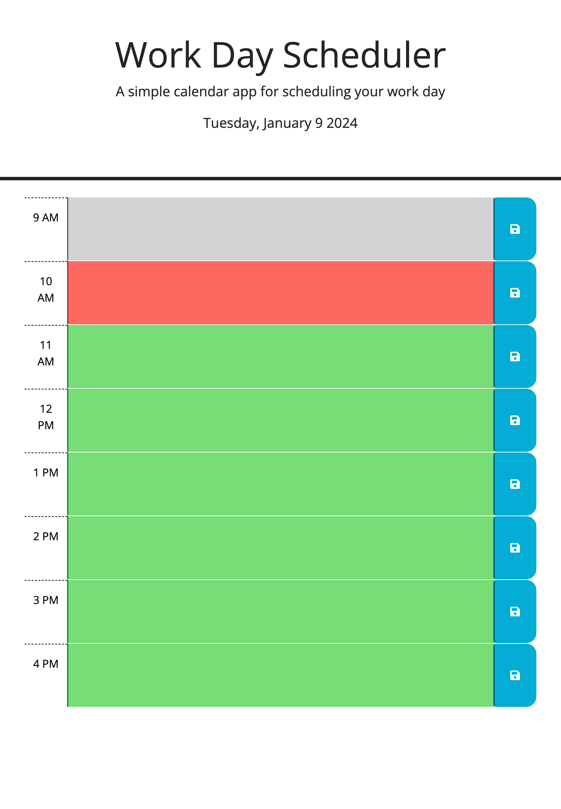

# Basic Scheduling Application #
A basic application that enables a user to keep track of a typical
9-5 workday schedule.

## How it Functions ##
The application uses JavaScript to dynamically create a webpage, where
divs are created for each hour of the schedule. These sections change
color based on current time of day. The user can also save the input
fields into local storage, and that data is pulled up when the page
is opened.

## Works Cited ##
Dayjs webdocs
MDN webdocs
Tutor session

[Deployed application here.](https://pm-912.github.io/calendar/)

While this shows the page, it does not show the color changing capabilities.
